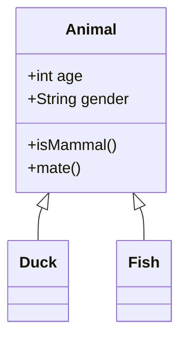
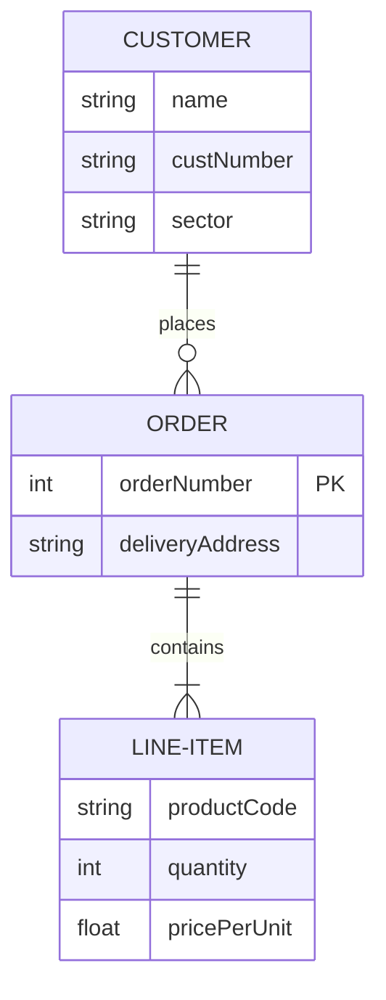

# Mermaid Parser MCP

Mermaidダイアグラムを解析し、構造化データとして取得できるMCPサーバー

## 機能

### mermaid_parse ツール

Mermaidダイアグラムのテキストを解析し、構造化されたJSON形式でデータを返却するツールです。

#### パラメータ

- `content` (string, 必須): 解析対象のMermaidダイアグラムテキスト

#### 対応ダイアグラム

- **クラス図 (classDiagram)**: オブジェクト指向設計のクラス構造を解析
  - クラス名、属性（名前、型、可視性）、メソッド（名前、可視性）を抽出
  - クラス間の関係性（継承、コンポジション、集約など）を識別

- **ER図 (erDiagram)**: エンティティ関係図を解析
  - エンティティ名、属性（名前、型、制約）を抽出
  - エンティティ間のリレーションシップとカーディナリティを識別
  - 主キー(PK)、外部キー(FK)、ユニークキー(UK)の制約を認識

#### 返却値

解析結果をJSON形式で返却します。エラーが発生した場合は、エラーメッセージを含むレスポンスを返します。

## インストール

```bash
npm install
npm run build
```

## MCPサーバーの登録

Claude DesktopアプリケーションでこのMCPサーバーを使用するには、設定ファイルに以下を追加してください。

### 設定ファイルの場所

- macOS: `~/Library/Application Support/Claude/claude_desktop_config.json`
- Windows: `%APPDATA%\Claude\claude_desktop_config.json`
- Linux: `~/.config/Claude/claude_desktop_config.json`

### 設定例

GitHubリポジトリから直接インストールする場合：

```json
{
  "mcpServers": {
    "mermaid-parser-mcp": {
      "command": "npx",
      "args": ["-y", "git+https://github.com/taiki-ssss/mermaid-parser-mcp"]
    }
  }
}
```

Gitリポジトリをクローンして使用する場合：

```bash
# リポジトリをクローン
git clone https://github.com/taiki-ssss/mermaid-parser-mcp.git
cd mermaid-parser-mcp
npm install
npm run build
```

```json
{
  "mcpServers": {
    "mermaid-parser-mcp": {
      "command": "node",
      "args": ["/path/to/mermaid-parser-mcp/dist/app/index.js"]
    }
  }
}
```

## 使用方法

MCPクライアントから`mermaid_parse`ツールを呼び出し、Mermaidダイアグラムのテキストを渡すことで解析結果を取得できます。

### クラス図 (Class Diagram)

クラス図はオブジェクト指向設計における、クラス間の関係性を表現するダイアグラムです。

#### サポートしている要素

- **クラス定義**: クラス名、属性、メソッド
- **可視性**: `+` (public), `-` (private), `#` (protected), `~` (package)
- **関係性**:
  - `<|--`: 継承 (inheritance)
  - `*--`: コンポジション (composition)
  - `o--`: 集約 (aggregation)
  - `-->`: 関連 (association)
  - `..>`: 依存 (dependency)
  - `..|>`: 実現 (realization)

### 入力例



### 出力例

```json
{
  "classes": [
    {
      "name": "Animal",
      "members": [
        {
          "name": "age",
          "type": "property",
          "visibility": "public",
          "dataType": "int"
        },
        {
          "name": "gender",
          "type": "property",
          "visibility": "public",
          "dataType": "String"
        },
        {
          "name": "isMammal",
          "type": "method",
          "visibility": "public"
        },
        {
          "name": "mate",
          "type": "method",
          "visibility": "public"
        }
      ]
    },
    {
      "name": "Duck",
      "members": []
    },
    {
      "name": "Fish",
      "members": []
    }
  ],
  "relationships": [
    {
      "from": "Animal",
      "to": "Duck",
      "type": "inheritance"
    },
    {
      "from": "Animal",
      "to": "Fish",
      "type": "inheritance"
    }
  ]
}
```

### ER図 (Entity Relationship Diagram)

ER図はデータベース設計における、エンティティ間の関係性を表現するダイアグラムです。

#### サポートしている要素

- **エンティティ定義**: エンティティ名と属性
- **属性の型**: string, int, float, boolean, date, timestamp, json, array など
- **制約**: PK (主キー), FK (外部キー), UK (ユニークキー)
- **カーディナリティ**:
  - `||--o{`: 1対多 (one to many)
  - `||--||`: 1対1 (one to one)
  - `}o--o{`: 多対多 (many to many)
  - `||--o|`: 1対0または1 (one to zero or one)

### 入力例



### 出力例

```json
{
  "entities": [
    {
      "name": "CUSTOMER",
      "attributes": [
        {
          "name": "name",
          "type": "string",
          "constraints": []
        },
        {
          "name": "custNumber",
          "type": "string",
          "constraints": []
        },
        {
          "name": "sector",
          "type": "string",
          "constraints": []
        }
      ]
    },
    {
      "name": "ORDER",
      "attributes": [
        {
          "name": "orderNumber",
          "type": "int",
          "constraints": ["PK"]
        },
        {
          "name": "deliveryAddress",
          "type": "string",
          "constraints": []
        }
      ]
    },
    {
      "name": "LINE-ITEM",
      "attributes": [
        {
          "name": "productCode",
          "type": "string",
          "constraints": []
        },
        {
          "name": "quantity",
          "type": "int",
          "constraints": []
        },
        {
          "name": "pricePerUnit",
          "type": "float",
          "constraints": []
        }
      ]
    }
  ],
  "relationships": [
    {
      "from": "CUSTOMER",
      "to": "ORDER",
      "type": "places",
      "cardinality": {
        "from": "one",
        "to": "many"
      }
    },
    {
      "from": "ORDER",
      "to": "LINE-ITEM",
      "type": "contains",
      "cardinality": {
        "from": "one",
        "to": "many"
      }
    }
  ]
}
```