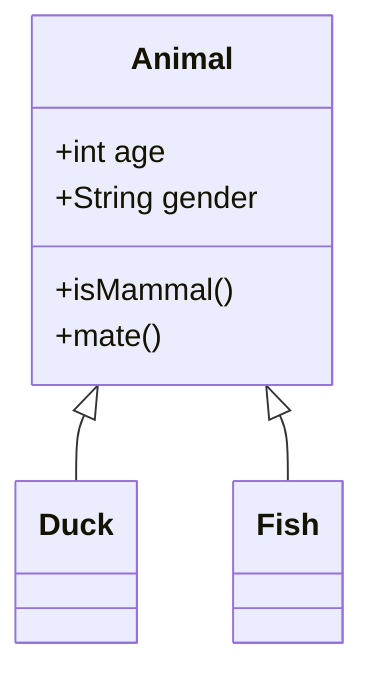

# Mermaid Parser MCP

Mermaidダイアグラムを解析し、構造化データとして取得できるMCPサーバー

## 機能

### mermaid_parse ツール

Mermaidダイアグラムのテキストを解析し、構造化されたJSON形式でデータを返却するツールです。

#### パラメータ

- `content` (string, 必須): 解析対象のMermaidダイアグラムテキスト

#### 対応ダイアグラム

- **クラス図 (classDiagram)**: オブジェクト指向設計のクラス構造を解析
  - クラス名、属性（名前、型、可視性）、メソッド（名前、可視性）を抽出
  - クラス間の関係性（継承、コンポジション、集約など）を識別

#### 返却値

解析結果をJSON形式で返却します。エラーが発生した場合は、エラーメッセージを含むレスポンスを返します。

## インストール

```bash
npm install
npm run build
```

## MCPサーバーの登録

Claude DesktopアプリケーションでこのMCPサーバーを使用するには、設定ファイルに以下を追加してください。

### 設定ファイルの場所

- macOS: `~/Library/Application Support/Claude/claude_desktop_config.json`
- Windows: `%APPDATA%\Claude\claude_desktop_config.json`
- Linux: `~/.config/Claude/claude_desktop_config.json`

### 設定例

GitHubリポジトリから直接インストールする場合：

```json
{
  "mcpServers": {
    "mermaid-parser-mcp": {
      "command": "npx",
      "args": ["-y", "git+https://github.com/[your-username]/mermaid-parser-mcp"]
    }
  }
}
```

Gitリポジトリをクローンして使用する場合：

```bash
# リポジトリをクローン
git clone https://github.com/taiki-ssss/mermaid-parser-mcp.git
cd mermaid-parser-mcp
npm install
npm run build
```

```json
{
  "mcpServers": {
    "mermaid-parser-mcp": {
      "command": "node",
      "args": ["/path/to/mermaid-parser-mcp/dist/app/index.js"]
    }
  }
}
```

## 使用方法

MCPクライアントから`mermaid_parse`ツールを呼び出し、Mermaidダイアグラムのテキストを渡すことで解析結果を取得できます。

### クラス図 (Class Diagram)

クラス図はオブジェクト指向設計における、クラス間の関係性を表現するダイアグラムです。

#### サポートしている要素

- **クラス定義**: クラス名、属性、メソッド
- **可視性**: `+` (public), `-` (private), `#` (protected), `~` (package)
- **関係性**:
  - `<|--`: 継承 (inheritance)
  - `*--`: コンポジション (composition)
  - `o--`: 集約 (aggregation)
  - `-->`: 関連 (association)
  - `..>`: 依存 (dependency)
  - `..|>`: 実現 (realization)

### 入力例



### 出力例

```json
{
  "type": "classDiagram",
  "classes": [
    {
      "name": "Animal",
      "attributes": [
        { "name": "age", "type": "int", "visibility": "+" },
        { "name": "gender", "type": "String", "visibility": "+" }
      ],
      "methods": [
        { "name": "isMammal", "visibility": "+" },
        { "name": "mate", "visibility": "+" }
      ]
    },
    {
      "name": "Duck",
      "attributes": [],
      "methods": []
    },
    {
      "name": "Fish",
      "attributes": [],
      "methods": []
    }
  ],
  "relationships": [
    { "from": "Duck", "to": "Animal", "type": "inheritance" },
    { "from": "Fish", "to": "Animal", "type": "inheritance" }
  ]
}
```